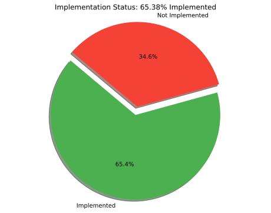

# Data Resources Dashboard

## Implementation Status

**0 out of 2 resources implemented (0.0%)**

## Available Data Resources

| Name             | Description               | Provider   | Type      | Url                                                                                     | Format           | Update frequency   | Harverster            | Implemented   | Priority   |
|:-----------------|:--------------------------|:-----------|:----------|:----------------------------------------------------------------------------------------|:-----------------|:-------------------|:----------------------|:--------------|:-----------|
| 3d constructions | Lod 2.2 3d construction   | paradigm   | mesh      | https://datastore.brussels/web/data/dataset/e9ec2aa4-cffd-11ee-bccc-00090ffe0001#access | shp/dwg/gpkg/skp | 1mounth            | nan                   | no            | high       |
| Vehicle Position | real time train positions | sncb       | telemetry | nan                                                                                     | geojson          | 30seconds          | tionGeometryHarvester | yes           | nan        |

---

*This dashboard is automatically generated based on data.csv*
